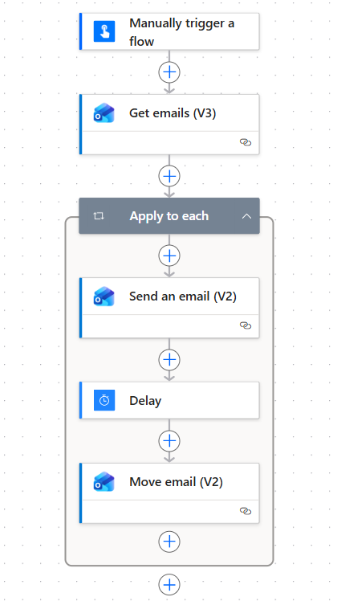
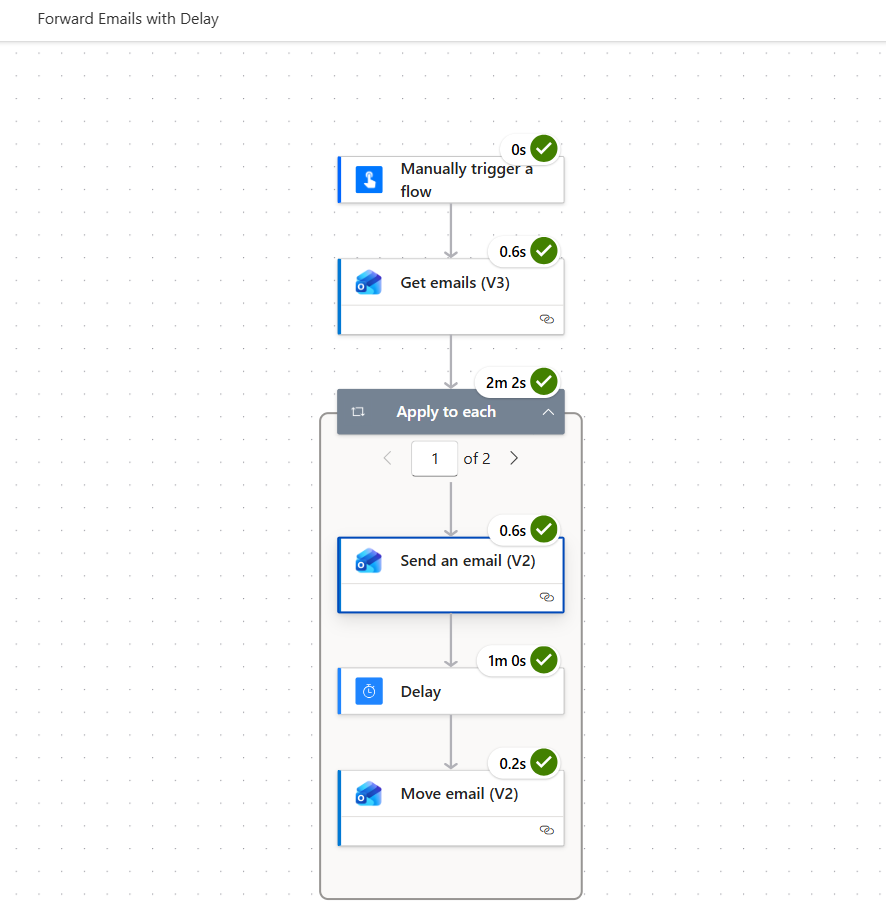

# Power Automate – Outlook Email Processing/Forwarding with Delay

## Overview
This repository contains a reference Power Automate flow that demonstrates
controlled, sequential processing of Outlook emails using Apply to each
and Delay.

The flow was built, tested, and validated in a personal Microsoft 365 tenant
and is shared for community learning.

## Features
- Processes emails from a selected folder
- Sends emails sequentially
- Enforces delay between sends
- Prevents reprocessing via Move email
- Explicit concurrency control (degree = 1)

## Why this exists
Delay actions may appear to work without concurrency control for small datasets.
This solution demonstrates the **guaranteed** pattern suitable for reuse.

## Included

- **Unmanaged solution ZIP**  
  A reusable Power Automate solution containing the sample email‑processing flow. Available from the GitHub Releases section.

- **Sample screenshots**  
  Flow design and execution history screenshots captured from a real run, including delay timing.

- **Documentation**  
  A complete step-by-step walkthrough with configuration details and screenshots is available here:
[Power Automate: How to Process and Forward Emails with Delay (Step‑by‑Step Guide)](https://sunilpashikanti.blogspot.com/2026/04/power-automate-process-emails-with-delay-step-by-step.html)

In this sample, emails are moved after processing. In production scenarios, you may further guard this with conditional run-after settings.

## Download

The latest release (unmanaged solution ZIP) is available here:  
👉 https://github.com/spashikanti/power-automate-forward-email-delay-pattern/releases/latest

## Screenshots

### Flow Overview

### Run History (Delay respected)

## License
MIT
